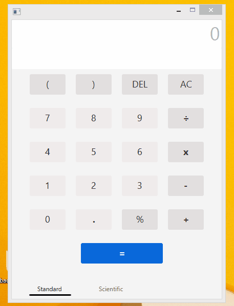
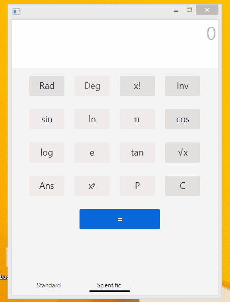

# Scientific-Calculator
A desktop calculator app built with JavaFX. It can handle arithmetic operations, Trig functions, Factorial, Natural selections, logarithm, Nth-Root, Exponential, conversion to Radians
[ ] Delete Trig
[ ] Handle AC
[ ] Get last expression

